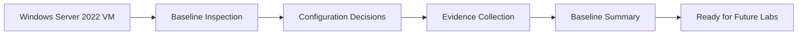

# Lab 01 — Build a Windows Server Operational Baseline

## 1. Lab Summary

**Lab:** Lab 01 — Build a Windows Server Operational Baseline  
**Topic area:** Windows Server foundations  
**Difficulty:** Foundational, but production-focused  
**Status:** Not started

### Objective

Build an operational baseline for your existing Windows Server 2022 VM. The goal is not to install lots of roles yet. The goal is to prove that the server is identifiable, patched or update-aware, reachable, secure enough for a lab, observable, and ready for future Active Directory, PowerShell, Azure and monitoring labs.

This lab is not a copy-paste tutorial. You must inspect the system, make decisions, capture evidence, and avoid unsafe shortcuts such as disabling the firewall or exposing credentials.

---

## 2. Scenario

You have joined an infrastructure operations team and have been given a newly built Windows Server 2022 VM.

Before the server can be used for Active Directory, DNS, file services, monitoring, automation or Azure hybrid labs, your manager asks you to create a clean operational baseline.

The requirement is:

> Inspect the Windows Server VM, record its current state, apply basic safe configuration, verify that core services and logs are healthy, and produce evidence that the server is ready for future infrastructure labs.

---

## 3. Reference Material

Use these references while solving the lab.

| Area | Suggested reference | Used? |
| --- | --- | --- |
| Cloud/system administration mindset | The Practice of Cloud System Administration |  |
| Windows Server administration | Windows Server 2022 and PowerShell |  |
| PowerShell discovery | Learn PowerShell in a Month of Lunches |  |
| Operating systems theory | Modern Operating Systems / Operating System Concepts |  |
| Microsoft documentation | Windows Server, PowerShell, Windows Update, Event Viewer, Firewall and Remote Management documentation |  |
| AI-assisted administration | `docs/ai-usage-standard.md`, if AI is used |  |

---

## 4. Requirements

| ID | Requirement | Status |
| --- | --- | --- |
| R1 | Confirm the VM can be accessed safely through console or RDP | Not started |
| R2 | Capture OS, hardware, hostname, domain/workgroup and PowerShell version information | Not started |
| R3 | Decide and apply a sensible server naming convention | Not started |
| R4 | Check Windows Update state and install updates if appropriate | Not started |
| R5 | Review network configuration without breaking connectivity | Not started |
| R6 | Confirm Windows Firewall is enabled and document profile state | Not started |
| R7 | Review local users, groups and administrator access | Not started |
| R8 | Check important services and recent event logs | Not started |
| R9 | Create a local evidence folder for baseline output | Not started |
| R10 | Capture verification evidence that the server is ready for future labs | Not started |
| R11 | Avoid exposing passwords, secrets, private keys or sensitive screenshots | Not started |

---

## 5. Constraints

You must not:

* disable Windows Firewall
* expose the server directly to the public internet
* paste passwords, product keys or private information into the lab output
* commit screenshots containing sensitive details
* install AD DS, DNS, DHCP, IIS or other roles yet
* promote the server to a domain controller yet
* make network changes you cannot reverse
* rely only on GUI screenshots when PowerShell evidence is available
* mark the lab complete without verification evidence

---

## 6. Assumptions

Record your actual assumptions after completing the lab.

Default assumptions:

* The server is a non-production Windows Server 2022 VM.
* You have local administrator access.
* The VM is for learning and lab use only.
* The server may later become part of the Windows and Azure lab environment.
* The server should remain secure, recoverable and easy to troubleshoot.

---

## 7. Expected Environment or Target State

By the end of the lab, the server should have:

* a clear hostname
* known OS version and build information
* known PowerShell version
* known network configuration
* Windows Firewall enabled
* Windows Update state checked and documented
* local administrator access reviewed
* core services checked
* recent critical/error events reviewed
* an evidence folder containing safe command output
* no unnecessary roles installed
* no secrets exposed

Suggested hostname format:

```text
WS22-LAB01
```

Use a different name if you can justify it.

---

## 8. Deliverables

You do not need to manually write the final lab report. After solving the lab, send the evidence to the assistant.

| Deliverable | Purpose |
| --- | --- |
| Command output evidence | Proves server state and configuration |
| Notes on changes made | Allows the final report to document implementation clearly |
| Issues/errors encountered | Allows troubleshooting evidence to be documented |
| Seven reflection answers | Allows the final lab report to be completed |

---

## 9. Implementation Tasks

### Task 1 — Create a VM checkpoint or recovery point

Before making changes, create a checkpoint/snapshot in your hypervisor if supported.

You need to prove:

* you know how to roll back the VM
* you created a recovery point before changes, or you documented why one was not available

Evidence to collect:

```text
Checkpoint/snapshot name and timestamp, or a short note explaining why this was not possible.
```

---

### Task 2 — Start a PowerShell transcript and create an evidence folder

Create a local folder for evidence.

Useful commands:

```powershell
New-Item -Path C:\Ops\Baseline -ItemType Directory -Force
Start-Transcript -Path C:\Ops\Baseline\lab-01-transcript.txt
```

You need to prove:

* an evidence folder exists
* command output was captured safely

---

### Task 3 — Capture server identity and OS information

Collect basic server facts.

Useful commands:

```powershell
hostname
whoami
$PSVersionTable
Get-ComputerInfo | Select-Object WindowsProductName, WindowsVersion, OsBuildNumber, OsArchitecture, CsName, CsDomain, CsManufacturer, CsModel, CsProcessors, CsTotalPhysicalMemory
Get-CimInstance Win32_OperatingSystem | Select-Object Caption, Version, BuildNumber, InstallDate, LastBootUpTime
```

You need to prove:

* the server OS is known
* the server hostname is known
* the PowerShell version is known
* the system has enough baseline information for future troubleshooting

---

### Task 4 — Decide whether to rename the server

Check the current hostname. If it is unclear or auto-generated, rename it using a sensible lab naming convention.

Useful commands:

```powershell
hostname
Rename-Computer -NewName "WS22-LAB01" -Restart
```

Only rename if needed. If you rename, the server will need to restart.

You need to prove:

* you made a naming decision
* the final hostname is clear
* the server came back after restart, if renamed

---

### Task 5 — Check update state

Check whether the server is patched or has pending updates.

Use GUI, PowerShell or both. Document what you used.

Useful commands:

```powershell
Get-HotFix | Sort-Object InstalledOn -Descending | Select-Object -First 10
Get-ComputerInfo | Select-Object OsHotFixes
```

You may also use:

```text
Settings > Windows Update
```

You need to prove:

* update state was checked
* recent hotfixes or pending update status were recorded
* any restart requirement was noted

Do not force risky update changes if you are unsure. Document the state honestly.

---

### Task 6 — Review network configuration

Inspect the current network configuration. Do not change the IP configuration unless you understand how to recover connectivity.

Useful commands:

```powershell
Get-NetIPConfiguration
Get-NetAdapter
Get-DnsClientServerAddress
Test-NetConnection 8.8.8.8
Test-NetConnection microsoft.com -Port 443
```

You need to prove:

* the server has a working network adapter
* IP configuration is known
* DNS configuration is known
* outbound connectivity works, if internet access is expected

Decision to make:

```text
Should this server stay on DHCP for now, or should it later receive a static IP before AD DS/DNS labs?
```

For Lab 1, recording the decision is enough.

---

### Task 7 — Review Windows Firewall state

Confirm Windows Firewall is enabled and record profile state.

Useful commands:

```powershell
Get-NetFirewallProfile | Select-Object Name, Enabled, DefaultInboundAction, DefaultOutboundAction
Get-NetConnectionProfile
```

You need to prove:

* firewall profile state is known
* firewall is not disabled as a shortcut
* network profile is understood

---

### Task 8 — Review local users and administrator access

Review local users and local administrators. Do not expose passwords.

Useful commands:

```powershell
Get-LocalUser
Get-LocalGroupMember Administrators
```

You need to prove:

* local admin access is understood
* no unexpected local administrator accounts are present, or they are documented
* password values are never displayed or recorded

---

### Task 9 — Review services and event logs

Check core services and recent critical/error events.

Useful commands:

```powershell
Get-Service | Sort-Object Status, Name | Select-Object Status, Name, DisplayName
Get-WinEvent -FilterHashtable @{LogName='System'; Level=1,2; StartTime=(Get-Date).AddDays(-7)} -MaxEvents 20 | Select-Object TimeCreated, Id, ProviderName, LevelDisplayName, Message
Get-WinEvent -FilterHashtable @{LogName='Application'; Level=1,2; StartTime=(Get-Date).AddDays(-7)} -MaxEvents 20 | Select-Object TimeCreated, Id, ProviderName, LevelDisplayName, Message
```

You need to prove:

* you can inspect service state
* you can query Windows event logs
* you can identify whether there are recent critical/error events worth investigating

If an error appears, do not panic. Record it and investigate enough to explain whether it is relevant.

---

### Task 10 — Create a simple baseline report file

Create a short text or markdown file on the server that summarises the baseline.

Suggested path:

```text
C:\Ops\Baseline\server-baseline-summary.md
```

Minimum sections:

```text
# Server Baseline Summary

Hostname:
OS version:
PowerShell version:
Network state:
Firewall state:
Update state:
Local admin notes:
Recent event log findings:
Issues found:
Ready for next lab: Yes/No
```

Stop the transcript when finished:

```powershell
Stop-Transcript
```

---

## 10. Key Commands Used

Record these in your evidence if you use them:

| Command | Purpose |
| --- | --- |
| `Start-Transcript` | Captures PowerShell session evidence |
| `Get-ComputerInfo` | Captures OS and hardware information |
| `$PSVersionTable` | Shows PowerShell version |
| `Get-NetIPConfiguration` | Shows IP and DNS configuration |
| `Test-NetConnection` | Tests network reachability |
| `Get-NetFirewallProfile` | Shows firewall profile state |
| `Get-LocalUser` | Lists local users |
| `Get-LocalGroupMember Administrators` | Lists local administrators |
| `Get-Service` | Reviews service state |
| `Get-WinEvent` | Reviews event logs |
| `Get-HotFix` | Reviews installed hotfixes |
| `Stop-Transcript` | Ends evidence capture |

---

## 11. Files, Resources or Objects Created or Changed

Expected items:

| Path / Object / Resource | Purpose |
| --- | --- |
| `C:\Ops\Baseline\` | Evidence folder |
| `C:\Ops\Baseline\lab-01-transcript.txt` | PowerShell transcript |
| `C:\Ops\Baseline\server-baseline-summary.md` | Human-readable baseline summary |
| Hostname | Changed only if required |
| VM checkpoint/snapshot | Recovery point before changes |

---

## 12. Verification Evidence

Collect enough evidence to complete this table later.

| Check | Evidence to provide | Result |
| --- | --- | --- |
| Server identity known | Hostname and `Get-ComputerInfo` output | Passed / Failed |
| PowerShell version known | `$PSVersionTable` output | Passed / Failed |
| Update state checked | `Get-HotFix` or Windows Update evidence | Passed / Failed |
| Network state known | `Get-NetIPConfiguration` output | Passed / Failed |
| Connectivity tested | `Test-NetConnection` output | Passed / Failed |
| Firewall state reviewed | `Get-NetFirewallProfile` output | Passed / Failed |
| Local admin access reviewed | Local users/groups output | Passed / Failed |
| Event logs reviewed | `Get-WinEvent` output or summary | Passed / Failed |
| Evidence folder created | `C:\Ops\Baseline` exists | Passed / Failed |
| Baseline summary created | `server-baseline-summary.md` exists | Passed / Failed |

---

## 13. AI Assistance Used

AI is optional for this lab.

Allowed AI use:

* ask AI to explain an event log error after sanitising the message
* ask AI to suggest what evidence a senior sysadmin would expect
* ask AI to review your baseline summary for clarity

Not allowed:

* paste secrets, private IPs if you do not want them recorded, tenant IDs, passwords or company data
* run AI-generated commands without understanding them
* invent verification evidence

If AI is not used, record:

> AI was not used for this lab.

---

## 14. Diagram



---

## 15. Issues Encountered

You do not need to fill this manually in the final report. Send me the issue/error details after solving the lab.

Record:

| Issue | Cause | Fix / Investigation |
| --- | --- | --- |
|  |  |  |

---

## 16. Decisions Made

Decisions to make during the lab:

| Decision | Options |
| --- | --- |
| Server name | Keep current name or rename to `WS22-LAB01` |
| Network configuration | Leave DHCP for now or plan static IP for future AD DS lab |
| Remote access | Use console only or enable/verify RDP safely |
| Update action | Install updates now or document pending updates and restart requirement |
| AI use | Use AI for explanation only or do the lab without AI |

---

## 17. Security and Production Considerations

Think about:

* why you should not disable the firewall
* why local administrator membership matters
* why update state matters before deploying roles
* why server naming matters operationally
* why event logs are baseline evidence
* why snapshots/checkpoints matter before change
* why production servers need monitoring and backup before critical roles are installed
* why AI-generated advice must be verified before use

---

## 18. Final Outcome

The final outcome will be written after you complete the lab and send evidence.

Expected outcome:

> The Windows Server 2022 VM was inspected, baseline evidence was captured, update/network/firewall/local access/event log state was reviewed, and the server was confirmed ready for the next lab or documented with issues requiring follow-up.

---

## 19. What I Learned

This section will be completed from your reflection answers.

---

## 20. What I Would Improve in Production

This section will be completed from your reflection answers and evidence.

---

## 21. References Used

Use actual references you checked.

| Reference | Used for |
| --- | --- |
| Windows Server 2022 and PowerShell | Server administration and PowerShell discovery |
| Learn PowerShell in a Month of Lunches | PowerShell command understanding |
| The Practice of Cloud System Administration | Operational baseline mindset |
| Microsoft Learn | Current Windows Server / PowerShell / Windows Update / Event Log guidance |
| AI Usage Standard | Only if AI was used |

---

## 22. Completion Checklist

* [ ] VM checkpoint/snapshot created or limitation documented
* [ ] Evidence folder created
* [ ] PowerShell transcript started
* [ ] Server identity captured
* [ ] OS version/build captured
* [ ] PowerShell version captured
* [ ] Hostname decision made
* [ ] Update state checked
* [ ] Network configuration reviewed
* [ ] Connectivity tested
* [ ] Firewall profile state reviewed
* [ ] Local users and administrators reviewed
* [ ] Services reviewed
* [ ] Event logs reviewed
* [ ] Baseline summary file created
* [ ] Transcript stopped
* [ ] No secrets or private data exposed
* [ ] Seven reflection questions answered

---

## 23. Seven Reflection Questions

After completing the lab, answer only these seven questions and send them with your evidence:

1. What problem did this lab solve?
2. What was the most important thing you configured, changed or proved?
3. What evidence proves the lab worked?
4. What issue or mistake did you encounter, and how did you fix or investigate it?
5. What would be risky about doing this in production?
6. What would you monitor, back up or document in a real environment?
7. What did you learn that you could explain in an interview?
