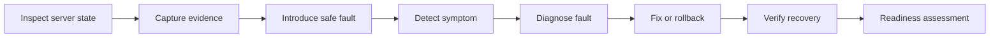

# Lab 01 — Windows Server and PowerShell Foundation

## 1. Lab Summary

**Lab:** Lab 01 — Windows Server and PowerShell Foundation  
**Topic area:** Windows Server foundations  
**Primary source:** Windows Server 2022 and PowerShell  
**Supporting sources:** Learn PowerShell in a Month of Lunches, Microsoft Learn, Modern Operating Systems, operational practice references  
**Difficulty:** Foundational, but operationally demanding  
**Status:** Not started

### Objective

Use PowerShell to inspect a Windows Server VM, prove its current state, deliberately introduce one safe fault, diagnose it, fix it and decide whether the server is ready for the next lab.

This lab is not about making changes for the sake of it. It is about learning how a Windows administrator proves what a server is before trusting it for AD DS, DNS, file services, IIS, Azure/hybrid connectivity or automation.

---

## 2. Scenario

You have been given an existing Windows Server VM.

Before it can host infrastructure roles, you must prove that you understand the server from an administrator's perspective:

* OS identity
* PowerShell environment
* installed roles/features
* services
* networking
* DNS client state
* firewall state
* local access
* event logs
* update/hotfix state
* safe break/fix recovery

Your manager says:

> Before we add Active Directory, DNS or application services, prove this server is understood, documented and safe enough to continue. I want evidence, not guesses.

---

## 3. Source Mapping

| Source role | Source | How it is used |
| --- | --- | --- |
| Primary guide | Windows Server 2022 and PowerShell | Main structure for Windows Server administration, discovery and PowerShell-based inspection |
| PowerShell support | Learn PowerShell in a Month of Lunches | Command discovery, objects, pipeline, formatting and repeatable evidence collection |
| Current online docs | Microsoft Learn | Current PowerShell cmdlet syntax and behaviour |
| OS theory | Modern Operating Systems, 5e | Services, processes, logging, networking and system state concepts |
| Break/fix standard | `docs/break-fix-standard.md` | Required known-good, fault, detection, diagnosis, fix and recovery chain |
| Online documentation standard | `docs/online-documentation-standard.md` | Current documentation evidence and accessed-date tracking |
| Operational principle | The Practice of System and Network Administration | Documentation, repeatability, troubleshooting discipline and operational readiness |
| Cloud operations principle | The Practice of Cloud System Administration | Reliability thinking, automation, monitoring, risk reduction and evidence-based operations |
| AI standard | `docs/ai-usage-standard.md` | Used only if AI is used to explain sanitised errors or review evidence |

---

## 4. Current Online Documentation

Record these in your final evidence notes. Re-check links if the lab is repeated later.

| Source | Publisher | URL | Accessed | Used for |
| --- | --- | --- | --- | --- |
| Get-ComputerInfo | Microsoft Learn | https://learn.microsoft.com/en-us/powershell/module/microsoft.powershell.management/get-computerinfo | 2026-06-28 | OS and hardware inventory evidence |
| Start-Transcript | Microsoft Learn | https://learn.microsoft.com/en-us/powershell/module/microsoft.powershell.host/start-transcript | 2026-06-28 | PowerShell evidence capture |
| Get-Service | Microsoft Learn | https://learn.microsoft.com/en-us/powershell/module/microsoft.powershell.management/get-service | 2026-06-28 | Service inspection and break/fix evidence |
| Get-WindowsFeature | Microsoft Learn | https://learn.microsoft.com/en-us/powershell/module/servermanager/get-windowsfeature | 2026-06-28 | Installed role/feature inventory |

---

## 5. Requirements

| ID | Requirement | Part | Status |
| --- | --- | --- | --- |
| R1 | Create an evidence folder and transcript | Part A | Not started |
| R2 | Identify OS, build, hostname, workgroup/domain state and PowerShell version | Part A | Not started |
| R3 | Review installed roles and features without installing new infrastructure roles | Part A | Not started |
| R4 | Inspect networking, DNS client state and outbound connectivity | Part A | Not started |
| R5 | Confirm Windows Firewall state without disabling it | Part A | Not started |
| R6 | Review local users and local administrator membership | Part A | Not started |
| R7 | Inspect running/stopped services and recent critical/error logs | Part A | Not started |
| R8 | Check update/hotfix state | Part A | Not started |
| R9 | Complete a controlled break/fix exercise | Part B | Not started |
| R10 | Create a short server readiness assessment | Part B | Not started |
| R11 | Decide whether the VM is ready for Lab 02 | Part B | Not started |

---

## 6. Constraints

You must not:

* install AD DS yet
* install DNS Server yet
* promote the server to a domain controller yet
* install IIS yet
* install random roles/features just to make the lab look bigger
* disable Windows Firewall
* expose passwords, tenant IDs, keys, tokens or private data
* rely only on GUI evidence when PowerShell can prove the state
* mark the lab complete without Part A evidence, Part B evidence and break/fix evidence
* break a real work/company system
* run destructive commands without a rollback path

---

## 7. Expected Target State

By the end, you should know and be able to prove:

* hostname
* OS and build
* PowerShell version
* domain/workgroup state
* installed roles/features
* network configuration
* DNS client state
* outbound connectivity
* firewall profile state
* local users and local administrators
* service state
* recent System/Application critical and error events
* hotfix/update state
* break/fix baseline, fault, symptom, diagnosis, fix and recovery
* whether the server is ready for Lab 02

---

## 8. Deliverables

You do **not** need to write the final lab report manually.

After solving the lab, send:

| Deliverable | Purpose |
| --- | --- |
| Safe command output or screenshots | Proves what happened |
| `C:\Ops\Lab01\server-readiness-assessment.md` content | Lets the assistant produce final documentation |
| Break/fix evidence | Proves failure handling |
| Any errors or confusing output | Allows troubleshooting to be documented |
| Seven reflection answers | Allows final lab report completion |

---

# 9. Implementation Tasks

# Part A — New Content: Inspect and Prove Server State

## Task A1 — Prepare evidence capture

Open **PowerShell as Administrator**.

Run:

```powershell
New-Item -Path C:\Ops\Lab01 -ItemType Directory -Force
Start-Transcript -Path C:\Ops\Lab01\lab-01-transcript.txt
```

## Task A2 — Identify the server and PowerShell environment

```powershell
hostname
$PSVersionTable
Get-ComputerInfo | Select-Object WindowsProductName, WindowsVersion, OsBuildNumber, OsArchitecture, CsName, CsDomain, CsWorkgroup, CsManufacturer, CsModel, CsProcessors, CsTotalPhysicalMemory
Get-CimInstance Win32_OperatingSystem | Select-Object Caption, Version, BuildNumber, InstallDate, LastBootUpTime
```

## Task A3 — Inspect installed roles and features

```powershell
Get-WindowsFeature | Where-Object Installed -eq $true | Select-Object Name, DisplayName, InstallState
Get-WindowsFeature | Select-Object Name, DisplayName, InstallState
```

In your notes, identify whether these appear installed:

* AD DS
* DNS
* DHCP
* File Services
* IIS / Web Server
* Hyper-V

## Task A4 — Inspect networking and DNS client state

```powershell
Get-NetAdapter
Get-NetIPConfiguration
Get-DnsClientServerAddress
Get-NetConnectionProfile
Test-NetConnection 8.8.8.8
Test-NetConnection microsoft.com -Port 443
```

Decision to note:

```text
Should this VM remain on DHCP for now, or should it receive a static IP before AD DS/DNS labs?
```

Do not change the IP address yet unless explicitly instructed in a later lab.

## Task A5 — Inspect Windows Firewall state

```powershell
Get-NetFirewallProfile | Select-Object Name, Enabled, DefaultInboundAction, DefaultOutboundAction
```

Do not disable the firewall.

## Task A6 — Review local access

```powershell
Get-LocalUser | Select-Object Name, Enabled, LastLogon
Get-LocalGroupMember Administrators
```

Do not paste sensitive account names if they reveal private information. Sanitise if needed.

## Task A7 — Inspect services and logs

```powershell
Get-Service | Sort-Object Status, Name | Select-Object Status, Name, DisplayName
Get-WinEvent -FilterHashtable @{LogName='System'; Level=1,2; StartTime=(Get-Date).AddDays(-7)} -MaxEvents 20 | Select-Object TimeCreated, Id, ProviderName, LevelDisplayName, Message
Get-WinEvent -FilterHashtable @{LogName='Application'; Level=1,2; StartTime=(Get-Date).AddDays(-7)} -MaxEvents 20 | Select-Object TimeCreated, Id, ProviderName, LevelDisplayName, Message
```

## Task A8 — Check update and hotfix state

```powershell
Get-HotFix | Sort-Object InstalledOn -Descending | Select-Object -First 10
Get-ComputerInfo | Select-Object OsHotFixes
```

---

# Part B — Cumulative Drill: Break, Fix and Assess Readiness

## Task B1 — Controlled break/fix exercise

This is the deliberate failure exercise.

The preferred controlled fault is to stop the **Print Spooler** service if it exists. This is a lab-only fault and should not be done on a real production system without approval.

Run:

```powershell
$ServiceName = 'Spooler'
$Service = Get-Service -Name $ServiceName -ErrorAction SilentlyContinue

if ($null -eq $Service) {
    'Spooler service not found. Use the fallback file-dependency break/fix exercise instead.'
} else {
    'Known-good service state:'
    Get-Service -Name $ServiceName | Select-Object Name, Status, StartType

    'Introducing controlled fault: stopping service.'
    Stop-Service -Name $ServiceName -Force
    Get-Service -Name $ServiceName | Select-Object Name, Status, StartType

    'Detection check:'
    if ((Get-Service -Name $ServiceName).Status -ne 'Running') {
        'Fault detected: service is not running.'
    }

    'Fix: starting service again.'
    Start-Service -Name $ServiceName
    Get-Service -Name $ServiceName | Select-Object Name, Status, StartType

    'Recovery verification:'
    if ((Get-Service -Name $ServiceName).Status -eq 'Running') {
        'Recovered: service is running again.'
    } else {
        'Recovery failed or service did not return to running state. Investigate before continuing.'
    }
}
```

If the Spooler service does not exist or cannot be safely restarted, use this fallback file-dependency break/fix:

```powershell
New-Item -Path C:\Ops\Lab01\dependency.txt -ItemType File -Force
'This file represents a simple service dependency for Lab 01.' | Set-Content C:\Ops\Lab01\dependency.txt

'Known-good state:'
Test-Path C:\Ops\Lab01\dependency.txt

'Introducing controlled fault: renaming dependency file.'
Rename-Item -Path C:\Ops\Lab01\dependency.txt -NewName dependency.broken

'Symptom:'
Test-Path C:\Ops\Lab01\dependency.txt

'Diagnosis:'
Get-ChildItem C:\Ops\Lab01 | Select-Object Name, Length, LastWriteTime

'Fix: restoring dependency file.'
Rename-Item -Path C:\Ops\Lab01\dependency.broken -NewName dependency.txt

'Recovery verification:'
Test-Path C:\Ops\Lab01\dependency.txt
```

## Task B2 — Create the readiness assessment

Create this file:

```text
C:\Ops\Lab01\server-readiness-assessment.md
```

Use this structure:

```text
# Server Readiness Assessment

Hostname:
OS and build:
PowerShell version:
Domain/workgroup state:
Installed roles/features:
Network state:
DNS client state:
Firewall state:
Local administrator notes:
Service state summary:
Update/hotfix state:
Event log findings:
Break/fix scenario:
Known-good state:
Fault introduced:
Symptom observed:
Diagnostic evidence:
Fix applied:
Recovery verification:
Risks or issues:
Ready for next lab: Yes/No
Next recommended lab:
```

## Task B3 — Stop transcript

```powershell
Stop-Transcript
```

---

## 10. Break/Fix Exercise

The break/fix proof chain for this lab is:

```text
Known-good state -> controlled fault -> detection -> diagnosis -> fix -> recovery verification -> prevention note
```

Required notes:

| Break/Fix Item | Evidence / Notes |
| --- | --- |
| Known-good state | Service running or dependency file present |
| Controlled fault introduced | Service stopped or dependency file renamed |
| Expected failure | Service not running or dependency missing |
| Actual symptom | Captured command output |
| Detection method | `Get-Service` or `Test-Path` |
| Diagnostic evidence | PowerShell output |
| Root cause or likely cause | Controlled change introduced during lab |
| Fix or rollback applied | Service restarted or file restored |
| Recovery verification | Service running or `Test-Path` returns True |
| Production prevention | Monitoring/alerting, change control, runbook and documentation |

---

## 11. Key Commands Used

Key commands include:

```powershell
Start-Transcript
Get-ComputerInfo
Get-CimInstance
Get-WindowsFeature
Get-NetAdapter
Get-NetIPConfiguration
Get-DnsClientServerAddress
Get-NetConnectionProfile
Test-NetConnection
Get-NetFirewallProfile
Get-LocalUser
Get-LocalGroupMember
Get-Service
Stop-Service
Start-Service
Get-WinEvent
Get-HotFix
Stop-Transcript
```

---

## 12. Verification Evidence

| Check | Part | Evidence | Result |
| --- | --- | --- | --- |
| Server identity captured | Part A | PowerShell output | Pending |
| Roles/features reviewed | Part A | `Get-WindowsFeature` output | Pending |
| Network/DNS/firewall reviewed | Part A | PowerShell output | Pending |
| Users/admins reviewed | Part A | PowerShell output | Pending |
| Logs reviewed | Part A | `Get-WinEvent` output | Pending |
| Hotfix state reviewed | Part A | `Get-HotFix` output | Pending |
| Break/fix completed | Part B | Service or file-dependency recovery evidence | Pending |
| Readiness assessment created | Part B | Markdown file content | Pending |

---

## 13. AI Assistance Used

If AI is used, document:

| Item | Notes |
| --- | --- |
| AI tool used |  |
| Purpose |  |
| Prompt summary |  |
| Output accepted |  |
| Output rejected |  |
| Human verification |  |

If AI was not used, write:

```text
AI was not used for this lab.
```

---

## 14. Diagram



---

## 15. Issues Encountered

Record any unexpected issue here, such as:

* command not recognised
* access denied
* service missing
* service fails to restart
* event log query error
* network test failure
* unexpected installed role
* pending reboot or old patch state

---

## 16. Decisions Made

| Decision | Options |
| --- | --- |
| Hostname | Keep current name or rename later using a clean convention |
| Server readiness | Ready for next lab or needs remediation first |
| Network model | DHCP for now or static IP before AD DS/DNS |
| Role installation | No roles in Lab 1; roles begin in later labs |
| Update action | Install now, defer or document pending state |
| Break/fix path | Spooler service or fallback file-dependency exercise |
| AI use | No AI, or AI only for explaining sanitised errors |

---

## 17. Security and Production Considerations

Think about:

* why administrators inspect before changing systems
* why PowerShell evidence is more repeatable than screenshots
* why installed roles/features matter for risk and troubleshooting
* why firewall state should not be weakened casually
* why local administrator membership matters
* why event logs are operational evidence
* why patch state should be known before adding roles
* why even a small service stop requires change control in production
* why monitoring should detect service failure or missing dependencies
* why documentation helps future incident response

---

## 18. Final Outcome

This lab is complete only when:

* Part A inspection evidence is captured
* Part B break/fix evidence is captured
* the readiness assessment exists
* the transcript is stopped
* no sensitive data is exposed
* the seven reflection questions are answered

---

## 19. What I Learned

To be completed from learner evidence and reflection answers.

---

## 20. What I Would Improve in Production

To be completed from learner evidence and reflection answers.

---

## 21. References Used

| Reference | Used for |
| --- | --- |
| Windows Server 2022 and PowerShell | Primary learning structure |
| Microsoft Learn — Get-ComputerInfo | OS and hardware inventory evidence |
| Microsoft Learn — Start-Transcript | Session evidence capture |
| Microsoft Learn — Get-Service | Service inspection and break/fix |
| Microsoft Learn — Get-WindowsFeature | Installed roles/features |
| Break/Fix Lab Standard | Fault/recovery evidence model |
| Online Documentation Standard | Current docs evidence model |

---

## 22. Completion Checklist

* [ ] Evidence folder created
* [ ] PowerShell transcript started
* [ ] Server identity captured
* [ ] OS/build captured
* [ ] PowerShell version captured
* [ ] Domain/workgroup state captured
* [ ] Installed roles/features reviewed
* [ ] Network configuration reviewed
* [ ] DNS client state reviewed
* [ ] Connectivity tested
* [ ] Firewall state reviewed
* [ ] Local users reviewed
* [ ] Local administrators reviewed
* [ ] Services reviewed
* [ ] System event logs reviewed
* [ ] Application event logs reviewed
* [ ] Update/hotfix state checked
* [ ] Known-good break/fix state captured
* [ ] Controlled fault introduced
* [ ] Fault detected
* [ ] Fault diagnosed
* [ ] Fix or rollback applied
* [ ] Recovery verified
* [ ] Prevention note written
* [ ] Server readiness assessment created
* [ ] Transcript stopped
* [ ] No sensitive data exposed
* [ ] Seven reflection questions answered

---

## 23. Seven Reflection Questions

After completing both parts, answer only these seven questions and send them with your evidence:

1. What problem did this lab solve?
2. What was the most important thing you configured, changed or proved?
3. What evidence proves the lab worked?
4. What issue or mistake did you encounter, and how did you fix or investigate it?
5. What would be risky about doing this in production?
6. What would you monitor, back up or document in a real environment?
7. What did you learn that you could explain in an interview?
