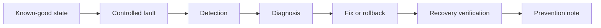

# Lab Output Template

Use this template for every Windows and Azure system administration lab. Keep it evidence-based, production-focused and clear enough for later portfolio review.

The learner's primary responsibility is to solve the lab and provide safe evidence. The final documentation can be completed from the learner's evidence and answers to the seven reflection questions.

Every core lab has two parts:

| Part | Purpose |
| --- | --- |
| Part A — New Content | Learn and apply the new topic from the primary source section |
| Part B — Cumulative Drill | Drill everything learned so far in a realistic production-style scenario |

Every lab also has a mandatory break/fix cycle:

```text
Known-good state -> deliberate failure -> detection -> diagnosis -> fix -> recovery verification -> prevention note
```

---

# Lab Title

## 1. Lab Summary

**Lab:**  
**Date completed:**  
**Topic area:**  
**Primary source:**  
**Supporting sources:**  
**Difficulty:**  
**Status:** Not started / In progress / Completed / Blocked

### Objective

State the purpose of the lab in 2–4 lines.

This lab is not a copy-paste tutorial. The learner is expected to understand the requirements, check the reference material, make decisions, complete both parts, deliberately break something safely, fix it and prove the final setup works.

---

## 2. Scenario

Describe the real-world situation this lab simulates.

Include:

* the business or operational problem
* the Windows Server / Azure / production context
* why the work matters
* what would happen if this was done badly
* what failure will be introduced or investigated

---

## 3. Source Mapping

| Source role | Source | How it is used |
| --- | --- | --- |
| Primary guide | Windows Server 2022 and PowerShell |  |
| PowerShell support | Learn PowerShell in a Month of Lunches |  |
| Azure support | Learning Microsoft Azure / Azure Cookbook |  |
| Endpoint support | Microsoft Intune Cookbook / Microsoft Learn |  |
| OS theory | Modern Operating Systems, 5e |  |
| Break/fix standard | Break/Fix Lab Standard |  |
| Operational principle | The Practice of System and Network Administration |  |
| Cloud operations principle | The Practice of Cloud System Administration |  |
| Current procedure | Microsoft Learn |  |
| AI standard | AI Usage Standard, if AI was used |  |

---

## 4. Requirements

| ID | Requirement | Part | Status |
| --- | --- | --- | --- |
| R1 |  | Part A | Not started |
| R2 |  | Part A | Not started |
| R3 |  | Part B | Not started |
| R4 | Complete a controlled break/fix cycle | Part A / Part B | Not started |

---

## 5. Constraints

You must not:

* expose passwords
* expose API keys or tokens
* expose Azure subscription IDs unless intentionally sanitised
* expose tenant identifiers where unnecessary
* use company/private data
* upload screenshots containing sensitive information
* commit book PDFs or EPUBs
* paste unsanitised AI prompts or outputs containing sensitive information
* rely only on the GUI when PowerShell, Azure CLI, logs or policy evidence would provide better proof
* mark the lab complete without verification evidence for both Part A and Part B
* mark the lab complete without break/fix evidence
* break real personal, work or company systems
* run destructive actions without a rollback path
* create unmanaged cloud cost

---

## 6. Assumptions

Record assumptions here.

Examples:

* This is a solo learning lab.
* The environment is non-production.
* Screenshots and command outputs will be sanitised.
* The lab may use local virtual machines and/or Azure resources.
* Cost controls and cleanup are required for cloud resources.
* Physical data-centre tasks may be simulated through diagrams, checklists or remote-hands instructions.
* Break/fix work is performed only against controlled lab resources.

---

## 7. Expected Environment or Target State

Describe the final state created by the lab.

Include relevant items such as:

* Windows Server roles
* AD DS objects
* DNS zones or records
* GPOs
* IIS sites, bindings or app pools
* FTP concepts or service checks
* mail/DNS records or mail-flow notes
* PowerShell scripts
* Entra users, groups or roles
* Intune policies
* Azure resource groups, VNets, VMs, NSGs or storage accounts
* monitoring, backup or alerting configuration
* VMware/SAN/storage concepts, if relevant
* Linux checks, if relevant
* incident or stakeholder communication artefacts, if relevant
* break/fix outcome and prevention note
* AI-assisted artefacts, if relevant

---

## 8. Deliverables

You do not need to manually write the final lab report. After solving the lab, send the evidence to the assistant.

| Deliverable | Part | Purpose |
| --- | --- | --- |
| Command output evidence | Part A / Part B | Proves configuration and troubleshooting work |
| Notes on changes made | Part A / Part B | Allows implementation to be documented clearly |
| Issues/errors encountered | Part A / Part B | Allows troubleshooting evidence to be documented |
| Break/fix evidence | Part A / Part B | Proves failure detection, diagnosis, fix and recovery verification |
| Scripts or generated reports | Part A / Part B | Proves automation and repeatability |
| Seven reflection answers | Final | Allows the final lab report to be completed |

---

## 9. Implementation Tasks

## Part A — New Content

Use this section to introduce and practise the new topic from the primary source.

### Task A1 —

Describe the task.

You need to prove:

* 
* 
* 

Useful commands may include:

```powershell
# Add useful commands here
```

### Task A2 —

Describe the task.

You need to prove:

* 
* 
* 

### Task A3 — Controlled New-Content Break/Fix

Break something related to the new topic safely.

You need to prove:

* known-good state before the break
* the controlled fault introduced
* symptom observed
* diagnostic evidence
* fix or rollback
* recovery verification

---

## Part B — Cumulative Drill

Use this section to drill everything learned so far.

The cumulative drill should reuse earlier skills such as:

* server inspection
* PowerShell evidence collection
* service checks
* Event Viewer or logs
* DNS/network checks
* AD or access checks, where relevant
* IIS/application checks, where relevant
* Azure/cloud parity reasoning
* monitoring, backup or incident thinking
* stakeholder communication, where relevant

### Task B1 —

Describe the cumulative scenario.

You need to prove:

* 
* 
* 

### Task B2 — Cumulative Break/Fix Drill

Describe the production-style fault to diagnose and fix.

You need to prove:

* what broke
* how it was detected
* what evidence isolated the fault domain
* what fixed it
* how recovery was verified
* what would prevent recurrence

---

## 10. Break/Fix Exercise

Every completed lab must document the break/fix cycle.

| Break/Fix Item | Evidence / Notes |
| --- | --- |
| Known-good state |  |
| Controlled fault introduced |  |
| Expected failure |  |
| Actual symptom |  |
| Detection method |  |
| Diagnostic evidence |  |
| Hypothesis |  |
| Root cause or likely cause |  |
| Fix or rollback applied |  |
| Recovery verification |  |
| Production prevention |  |
| Monitoring or alert that should catch this |  |

---

## 11. Key Commands Used

Record the important commands used.

| Command | Part | Purpose |
| --- | --- | --- |
|  | Part A / Part B / Break-Fix |  |
|  | Part A / Part B / Break-Fix |  |
|  | Part A / Part B / Break-Fix |  |

---

## 12. Files, Resources or Objects Created or Changed

| Path / Object / Resource | Part | Purpose |
| --- | --- | --- |
|  | Part A / Part B / Break-Fix |  |
|  | Part A / Part B / Break-Fix |  |
|  | Part A / Part B / Break-Fix |  |

---

## 13. Verification Evidence

This section proves that both parts worked and the break/fix recovery succeeded.

| Check | Part | Evidence | Result |
| --- | --- | --- | --- |
|  | Part A |  | Passed / Failed |
|  | Part B |  | Passed / Failed |
| Break/fix recovery verified | Break-Fix |  | Passed / Failed |

---

## 14. AI Assistance Used

Complete this section only if AI was used during the lab.

| Item | Notes |
| --- | --- |
| AI tool used |  |
| Purpose |  |
| Prompt summary |  |
| Output accepted |  |
| Output rejected |  |
| Human verification |  |

If AI was not used, write:

> AI was not used for this lab.

---

## 15. Diagram

Use a diagram if it improves understanding.



If no diagram is needed, write:

> No diagram required for this lab.

---

## 16. Issues Encountered

| Issue | Part | Cause | Fix / Investigation |
| --- | --- | --- | --- |
|  | Part A / Part B / Break-Fix |  |  |

If there were no unexpected issues, write:

> No unexpected issues encountered beyond the planned break/fix exercise.

---

## 17. Decisions Made

| Decision | Part | Reason |
| --- | --- | --- |
|  | Part A / Part B / Break-Fix |  |
|  | Part A / Part B / Break-Fix |  |

---

## 18. Security and Production Considerations

Explain the production relevance of this lab.

Cover where relevant:

* least privilege
* access control
* monitoring
* audit trail
* backup and restore
* rollback
* change control
* incident response
* cost control
* operational risk
* reliability
* documentation
* Azure/cloud parity
* VMware/SAN or physical data-centre limitations
* stakeholder communication
* break/fix prevention and monitoring
* AI governance, if AI was used

---

## 19. Final Outcome

State clearly whether the lab was completed.

Example:

> The lab was completed successfully. Part A introduced and verified the new capability. Part B drilled previous skills in a cumulative production-style scenario. A controlled break/fix exercise was completed, recovery was verified, and prevention notes were documented.

---

## 20. What I Learned

Summarise the learner's main learning points from the evidence and reflection answers.

* 
* 
* 

---

## 21. What I Would Improve in Production

Summarise practical production improvements.

* 
* 
* 

---

## 22. References Used

List the references actually used.

| Reference | Used for |
| --- | --- |
|  |  |
|  |  |

---

## 23. Completion Checklist

* [ ] Requirements understood
* [ ] Reference material checked
* [ ] Part A completed
* [ ] Part A verification evidence captured
* [ ] Part A break/fix attempted where relevant
* [ ] Part B cumulative drill completed
* [ ] Part B verification evidence captured
* [ ] Part B break/fix completed
* [ ] Known-good state documented
* [ ] Controlled fault documented
* [ ] Failure symptom documented
* [ ] Diagnostic evidence captured
* [ ] Fix or rollback documented
* [ ] Recovery verification captured
* [ ] Prevention or monitoring improvement documented
* [ ] Issues documented
* [ ] Decisions documented
* [ ] Security and production considerations documented
* [ ] Azure/cloud parity considered where relevant
* [ ] Diagram added if useful
* [ ] Files or resources documented
* [ ] AI use documented if relevant
* [ ] Work uploaded to the correct repository folder
* [ ] No secrets or private data committed
* [ ] Seven reflection questions answered

---

## 24. Seven Reflection Questions

Ask only these seven questions after the learner has solved both parts of the lab:

1. What problem did this lab solve?
2. What was the most important thing you configured, changed or proved?
3. What evidence proves the lab worked?
4. What issue or mistake did you encounter, and how did you fix or investigate it?
5. What would be risky about doing this in production?
6. What would you monitor, back up or document in a real environment?
7. What did you learn that you could explain in an interview?
