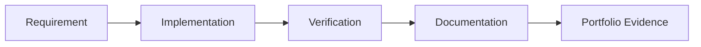

# Lab Output Template

Use this template for every Windows and Azure system administration lab. Keep it evidence-based, production-focused and clear enough for later portfolio review.

---

# Lab Title

## 1. Lab Summary

**Lab:**

**Date completed:**

**Topic area:**

**Difficulty:**

**Status:** Not started / In progress / Completed / Blocked

### Objective

State the purpose of the lab in 2–4 lines.

This lab is not a copy-paste tutorial. You are expected to understand the requirements, check the reference material, make decisions and prove the final setup works.

---

## 2. Scenario

Describe the real-world situation this lab simulates.

Example:

> You have joined an infrastructure operations team responsible for a small Microsoft environment. Your manager asks you to configure a secure Windows Server baseline, document the decisions, verify the configuration and explain how it would be operated in production.

---

## 3. Reference Material

Use the reference material to work out the correct steps.

| Area | Suggested reference | Used? |
| --- | --- | --- |
| Cloud operations design | The Practice of Cloud System Administration |  |
| Windows Server | Windows Server 2022 and PowerShell |  |
| Active Directory | Active Directory Administration Cookbook |  |
| PowerShell | Learn PowerShell in a Month of Lunches |  |
| Azure | Learning Microsoft Azure / Microsoft Learn |  |
| Intune | Microsoft Intune Cookbook / Microsoft Learn |  |
| Operating systems theory | Modern Operating Systems / Operating System Concepts |  |

---

## 4. Requirements

| ID | Requirement | Status |
| --- | --- | --- |
| R1 |  | Not started |
| R2 |  | Not started |
| R3 |  | Not started |

---

## 5. Constraints

You must not:

* expose passwords
* expose API keys or tokens
* expose Azure subscription IDs unless intentionally sanitised
* expose tenant identifiers where unnecessary
* use company/private data
* upload screenshots containing sensitive information
* commit book PDFs or EPUBs
* rely only on the GUI when PowerShell, Azure CLI or logs would provide better evidence
* mark the lab complete without verification evidence

---

## 6. Assumptions

Record your assumptions here.

Examples:

* This is a solo learning lab.
* The environment is non-production.
* Screenshots and command outputs will be sanitised.
* The lab may use local virtual machines and/or Azure resources.
* Cost controls and cleanup are required for cloud resources.

---

## 7. Expected Environment or Target State

Describe the final state you are trying to create.

Include relevant items such as:

* Windows Server roles
* AD DS objects
* DNS zones or records
* GPOs
* PowerShell scripts
* Entra users, groups or roles
* Intune policies
* Azure resource groups
* Azure VNets, VMs, NSGs or storage accounts
* monitoring, backup or alerting configuration

---

## 8. Deliverables

| Deliverable | Purpose |
| --- | --- |
|  |  |
|  |  |
|  |  |

---

## 9. Implementation Tasks

Use these tasks as a guide, not as a full walkthrough.

### Task 1 —

Describe the task.

You need to prove:

* 
* 
* 

Useful commands may include:

```powershell
# Add useful commands here
```

---

### Task 2 —

Describe the task.

You need to prove:

* 
* 
* 

---

### Task 3 —

Describe the task.

You need to prove:

* 
* 
* 

---

## 10. Key Commands Used

Record the important commands you used.

| Command | Purpose |
| --- | --- |
|  |  |
|  |  |
|  |  |

---

## 11. Files, Resources or Objects Created or Changed

| Path / Object / Resource | Purpose |
| --- | --- |
|  |  |
|  |  |
|  |  |

---

## 12. Verification Evidence

This section proves that the lab worked.

| Check | Evidence | Result |
| --- | --- | --- |
|  |  | Passed / Failed |
|  |  | Passed / Failed |
|  |  | Passed / Failed |

---

## 13. Diagram

Use a diagram if it improves understanding.



If no diagram is needed, write:

> No diagram required for this lab.

---

## 14. Issues Encountered

| Issue | Cause | Fix |
| --- | --- | --- |
|  |  |  |

If there were no issues, write:

> No major issues encountered.

---

## 15. Decisions Made

| Decision | Reason |
| --- | --- |
|  |  |
|  |  |

---

## 16. Security and Production Considerations

Explain the production relevance of this lab.

Cover where relevant:

* least privilege
* access control
* monitoring
* audit trail
* backup and restore
* rollback
* change control
* incident response
* cost control
* operational risk
* reliability
* documentation

Write your notes here:

```text
Add production relevance notes here.
```

---

## 17. Final Outcome

State clearly whether the lab was completed.

Example:

> The lab was completed successfully. The required configuration was implemented, verification evidence was captured, issues were documented and production considerations were recorded.

---

## 18. What I Learned

Write 3–6 bullet points.

* 
* 
* 

---

## 19. What I Would Improve in Production

Write 2–5 bullet points.

* 
* 
* 

---

## 20. References Used

List the references you actually used.

| Reference | Used for |
| --- | --- |
|  |  |
|  |  |

---

## 21. Completion Checklist

* [ ] Requirements understood
* [ ] Reference material checked
* [ ] Implementation completed
* [ ] Verification evidence captured
* [ ] Issues documented
* [ ] Decisions documented
* [ ] Security and production considerations documented
* [ ] Diagram added if useful
* [ ] Files or resources documented
* [ ] Work uploaded to the correct repository folder
* [ ] No secrets or private data committed
* [ ] Reflection completed

---

## 22. Reflection Questions

Answer these after completing the lab.

1. What problem did this lab solve?
2. What was the most important design decision?
3. What evidence proves the configuration worked?
4. What could fail in production?
5. How would you monitor this in production?
6. How would you recover from failure?
7. What would require change approval?
8. What would be risky to automate?
9. What would make this implementation more secure?
10. What would make this implementation more reliable?
11. What would a senior sysadmin expect to see in your documentation?
12. What would make this lab look careless to a hiring manager?
