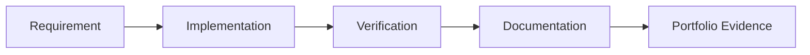

# Lab Output Template

Use this template for every Windows and Azure system administration lab. Keep it evidence-based, production-focused and clear enough for later portfolio review.

The learner's primary responsibility is to solve the lab and provide safe evidence. The final documentation can be completed from the learner's evidence and answers to the seven reflection questions.

---

# Lab Title

## 1. Lab Summary

**Lab:**

**Date completed:**

**Topic area:**

**Difficulty:**

**Status:** Not started / In progress / Completed / Blocked

### Objective

State the purpose of the lab in 2–4 lines.

This lab is not a copy-paste tutorial. The learner is expected to understand the requirements, check the reference material, make decisions and prove the final setup works.

---

## 2. Scenario

Describe the real-world situation this lab simulates.

Example:

> You have joined an infrastructure operations team responsible for a small Microsoft environment. Your manager asks you to configure a secure Windows Server baseline, document the decisions, verify the configuration and explain how it would be operated in production.

---

## 3. Reference Material

Use the reference material to work out the correct steps.

| Area | Suggested reference | Used? |
| --- | --- | --- |
| Cloud operations design | The Practice of Cloud System Administration |  |
| Windows Server | Windows Server 2022 and PowerShell |  |
| Active Directory | Active Directory Administration Cookbook |  |
| PowerShell | Learn PowerShell in a Month of Lunches |  |
| Azure | Learning Microsoft Azure / Microsoft Learn |  |
| Intune | Microsoft Intune Cookbook / Microsoft Learn |  |
| Operating systems theory | Modern Operating Systems / Operating System Concepts |  |
| AI-assisted administration | AI Usage Standard / Microsoft Learn / Copilot documentation |  |

---

## 4. Requirements

| ID | Requirement | Status |
| --- | --- | --- |
| R1 |  | Not started |
| R2 |  | Not started |
| R3 |  | Not started |

---

## 5. Constraints

You must not:

* expose passwords
* expose API keys or tokens
* expose Azure subscription IDs unless intentionally sanitised
* expose tenant identifiers where unnecessary
* use company/private data
* upload screenshots containing sensitive information
* commit book PDFs or EPUBs
* paste unsanitised AI prompts or outputs containing sensitive information
* rely only on the GUI when PowerShell, Azure CLI or logs would provide better evidence
* mark the lab complete without verification evidence

---

## 6. Assumptions

Record assumptions here.

Examples:

* This is a solo learning lab.
* The environment is non-production.
* Screenshots and command outputs will be sanitised.
* The lab may use local virtual machines and/or Azure resources.
* Cost controls and cleanup are required for cloud resources.

---

## 7. Expected Environment or Target State

Describe the final state created by the lab.

Include relevant items such as:

* Windows Server roles
* AD DS objects
* DNS zones or records
* GPOs
* PowerShell scripts
* Entra users, groups or roles
* Intune policies
* Azure resource groups
* Azure VNets, VMs, NSGs or storage accounts
* monitoring, backup or alerting configuration
* AI-assisted artefacts, if relevant

---

## 8. Deliverables

| Deliverable | Purpose |
| --- | --- |
|  |  |
|  |  |
|  |  |

---

## 9. Implementation Tasks

Use these tasks as a guide, not as a full walkthrough.

### Task 1 —

Describe the task.

You need to prove:

* 
* 
* 

Useful commands may include:

```powershell
# Add useful commands here
```

---

### Task 2 —

Describe the task.

You need to prove:

* 
* 
* 

---

### Task 3 —

Describe the task.

You need to prove:

* 
* 
* 

---

## 10. Key Commands Used

Record the important commands used.

| Command | Purpose |
| --- | --- |
|  |  |
|  |  |
|  |  |

---

## 11. Files, Resources or Objects Created or Changed

| Path / Object / Resource | Purpose |
| --- | --- |
|  |  |
|  |  |
|  |  |

---

## 12. Verification Evidence

This section proves that the lab worked.

| Check | Evidence | Result |
| --- | --- | --- |
|  |  | Passed / Failed |
|  |  | Passed / Failed |
|  |  | Passed / Failed |

---

## 13. AI Assistance Used

Complete this section only if AI was used during the lab.

| Item | Notes |
| --- | --- |
| AI tool used |  |
| Purpose |  |
| Prompt summary |  |
| Output accepted |  |
| Output rejected |  |
| Human verification |  |

If AI was not used, write:

> AI was not used for this lab.

---

## 14. Diagram

Use a diagram if it improves understanding.



If no diagram is needed, write:

> No diagram required for this lab.

---

## 15. Issues Encountered

| Issue | Cause | Fix |
| --- | --- | --- |
|  |  |  |

If there were no issues, write:

> No major issues encountered.

---

## 16. Decisions Made

| Decision | Reason |
| --- | --- |
|  |  |
|  |  |

---

## 17. Security and Production Considerations

Explain the production relevance of this lab.

Cover where relevant:

* least privilege
* access control
* monitoring
* audit trail
* backup and restore
* rollback
* change control
* incident response
* cost control
* operational risk
* reliability
* documentation
* AI governance, if AI was used

---

## 18. Final Outcome

State clearly whether the lab was completed.

Example:

> The lab was completed successfully. The required configuration was implemented, verification evidence was captured, issues were documented and production considerations were recorded.

---

## 19. What I Learned

Summarise the learner's main learning points from the evidence and reflection answers.

* 
* 
* 

---

## 20. What I Would Improve in Production

Summarise practical production improvements.

* 
* 
* 

---

## 21. References Used

List the references actually used.

| Reference | Used for |
| --- | --- |
|  |  |
|  |  |

---

## 22. Completion Checklist

* [ ] Requirements understood
* [ ] Reference material checked
* [ ] Implementation completed
* [ ] Verification evidence captured
* [ ] Issues documented
* [ ] Decisions documented
* [ ] Security and production considerations documented
* [ ] Diagram added if useful
* [ ] Files or resources documented
* [ ] AI use documented if relevant
* [ ] Work uploaded to the correct repository folder
* [ ] No secrets or private data committed
* [ ] Seven reflection questions answered

---

## 23. Seven Reflection Questions

Ask only these seven questions after the learner has solved the lab:

1. What problem did this lab solve?
2. What was the most important thing you configured, changed or proved?
3. What evidence proves the lab worked?
4. What issue or mistake did you encounter, and how did you fix or investigate it?
5. What would be risky about doing this in production?
6. What would you monitor, back up or document in a real environment?
7. What did you learn that you could explain in an interview?
